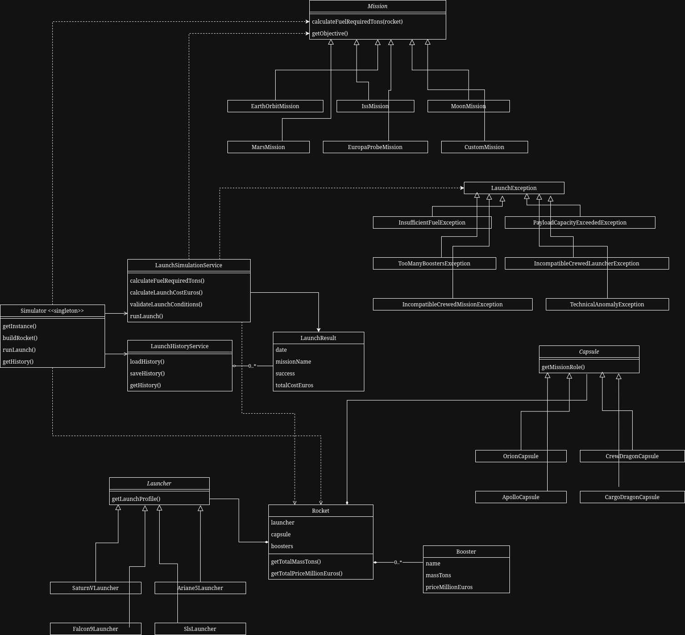

# Space Launch Simulator

Java console application for configuring a rocket, selecting a space mission, simulating a launch, calculating the result and saving the launch history.

## Requirements

- Java 17 or later
- Git
- A terminal compatible with ANSI escape sequences and the `stty` command

## Compile

From the project root:

```bash
javac -d out $(find src/main/java -name "*.java")
```

## Run

```bash
java -cp out Main
```

The application starts with an interactive console menu:

```text
Space Launch Simulator

Main menu

-> Configure rocket
   Choose mission
   Run launch simulation
   Display history
   Exit
```

Use the up/down arrows to move through menus and press `Enter` to select an option.

## Features

- Configure a rocket by choosing a launcher, a capsule and boosters.
- Choose a mission from the catalog or create a custom mission.
- Check whether the configured rocket is compatible with the selected mission.
- Simulate a full launch.
- Display success or failure with a detailed reason.
- Calculate the required fuel.
- Calculate the total mission cost.
- Save every launch result automatically.
- Reload and display the launch history when the application starts.

## Catalog

The component catalog is defined in `ComponentCatalog`.

### Launchers

Available launchers:

- Saturn V
- Ariane 5
- Falcon 9
- SLS

Each launcher has:

- a name;
- a crewed/uncrewed capability;
- a maximum number of boosters;
- a maximum fuel capacity;
- a maximum payload capacity;
- a price.

### Capsules

Available capsules:

- Orion
- Crew Dragon
- Apollo
- Cargo Dragon

Each capsule has:

- a name;
- a crewed/uncrewed flag;
- a maximum number of occupants;
- a mass;
- a price.

### Boosters

Available boosters:

- EAP (Ariane)
- SRB (Shuttle)
- BE-3

Each booster has:

- a name;
- an additional thrust value;
- a mass;
- a price.

### Missions

Available predefined missions:

- Earth orbit
- ISS
- Moon
- Mars
- Europa probe

Each mission has:

- a name;
- a crew requirement;
- a distance;
- a duration;
- a fuel coefficient;
- an objective.

The application also lets the user create a custom mission from the console.

## Personal Mission

The personal mission is `Europa probe`.

It represents an uncrewed probe mission to Europa, one of Jupiter's moons.

Mission values:

- crew required: no;
- distance: `628300000 km`;
- duration: `5 to 7 years`;
- fuel coefficient: `0.000006`;
- objective: send an uncrewed probe to Europa.

This mission is implemented by `EuropaProbeMission`, which extends the abstract `Mission` class.

## Business Rules

### Fuel Required

Fuel is calculated by the mission:

```text
fuel = (rocket total mass * mission distance * mission fuel coefficient) / 1000
```

The call is polymorphic:

```java
mission.calculateFuelRequiredTons(rocket)
```

### Launch Cost

The total launch cost is:

```text
total cost = rocket component price + (required fuel * kerosene price per ton)
```

The kerosene price is defined by the constant:

```java
PRICE_KEROSENE_PER_TON = 1200
```

### Failure Conditions

A launch fails if at least one of these conditions is true:

- required fuel is greater than launcher fuel capacity;
- rocket total mass is greater than launcher payload capacity;
- booster count is greater than launcher booster limit;
- a crewed mission uses an uncrewed launcher;
- a crewed mission uses an uncrewed capsule or a capsule with no occupants;
- a random technical anomaly occurs.

The random technical anomaly probability is defined by:

```java
RANDOM_FAILURE_PROBABILITY = 0.05
```

## Object-Oriented Design



### Inheritance

The project contains three main abstract hierarchies:

- `Launcher`
    - `SaturnVLauncher`
    - `Ariane5Launcher`
    - `Falcon9Launcher`
    - `SlsLauncher`
- `Capsule`
    - `OrionCapsule`
    - `CrewDragonCapsule`
    - `ApolloCapsule`
    - `CargoDragonCapsule`
- `Mission`
    - `EarthOrbitMission`
    - `IssMission`
    - `MoonMission`
    - `MarsMission`
    - `EuropaProbeMission`
    - `CustomMission`

### Composition

`Rocket` is built by composition:

- one `Launcher`;
- one `Capsule`;
- a list of `Booster`.

The rocket does not inherit from its parts. It owns them as components.

### Polymorphism

`LaunchSimulationService` receives a `Mission` reference and calls:

```java
mission.calculateFuelRequiredTons(rocket)
```

The actual implementation depends on the concrete mission class.

### Method Overloading

`Rocket` contains overloaded methods for adding boosters:

```java
addBooster(Booster booster)
addBoosters(List<Booster> boosters)
addBoosters(Booster firstBooster, Booster secondBooster)
```

`LaunchSimulationService` also provides multiple constructors depending on whether a custom `Random` or history service is provided.

### Custom Exceptions

Launch failures are represented by custom business exceptions:

- `InsufficientFuelException`
- `PayloadCapacityExceededException`
- `TooManyBoostersException`
- `IncompatibleCrewedLauncherException`
- `IncompatibleCrewedMissionException`
- `TechnicalAnomalyException`

All launch-related exceptions extend `LaunchException`.

## Simulator Orchestration

`Simulator` is the central application orchestrator.

It is responsible for coordinating:

- the component catalog;
- rocket configuration;
- launch simulation;
- compatibility checks;
- launch history access;
- history loading.

`Simulator` is implemented as a singleton so that there is only one simulator instance in the program.

## Persistence

Launch results are saved in:

```text
data/launch-history.csv
```

The history is:

- loaded when the application starts;
- updated after every launch simulation;
- displayed from the console menu.

Each saved launch contains:

- date;
- mission;
- success/failure result;
- failure or success reason;
- required fuel;
- total cost;
- rocket summary.

## Project Structure

```text
src/main/java/
├── Main.java
├── app/
│   ├── Simulator.java
│   └── SpaceLaunchApplication.java
├── domain/
│   ├── booster/
│   ├── capsule/
│   ├── launch/
│   ├── launcher/
│   ├── mission/
│   └── rocket/
├── exception/
├── persistence/
├── service/
└── ui/
```

## Example Demonstration Flow

1. Configure a rocket.
2. Choose a mission.
3. Run the launch simulation.
4. Read the displayed result.
5. Open the history menu to verify that the launch was archived.

Useful scenarios:

- successful launch;
- insufficient fuel failure;
- payload capacity failure;
- crewed mission with incompatible launcher or capsule;
- random technical anomaly.

## AI Declaration

- Written parts of the README
- Improvements to the UI behavior for the user
- General debugging
